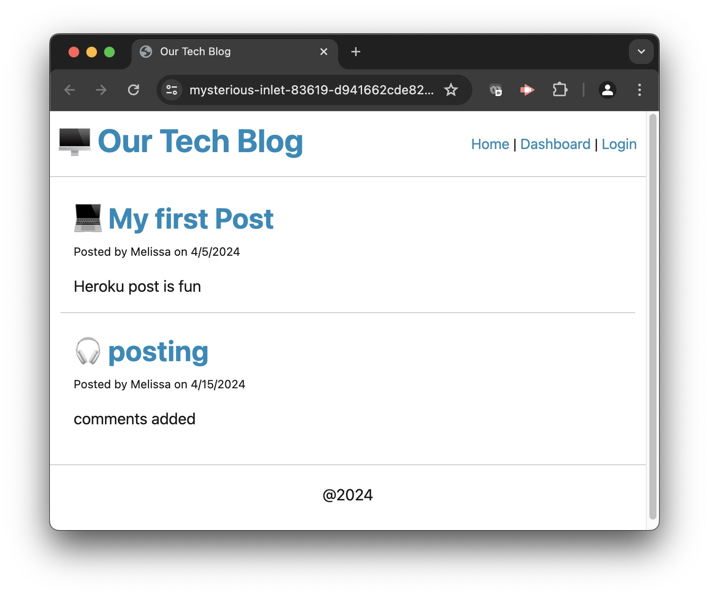
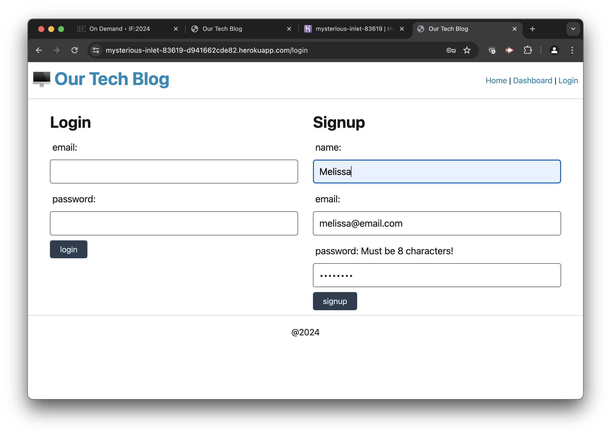
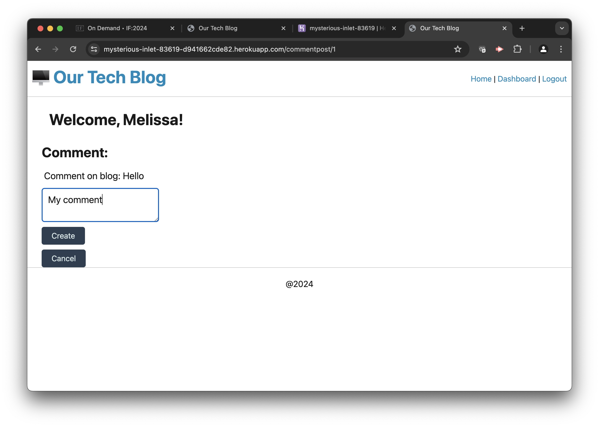
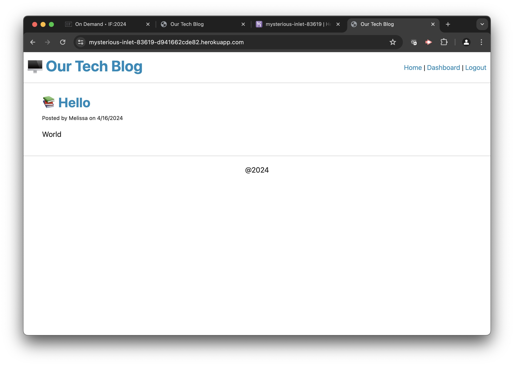
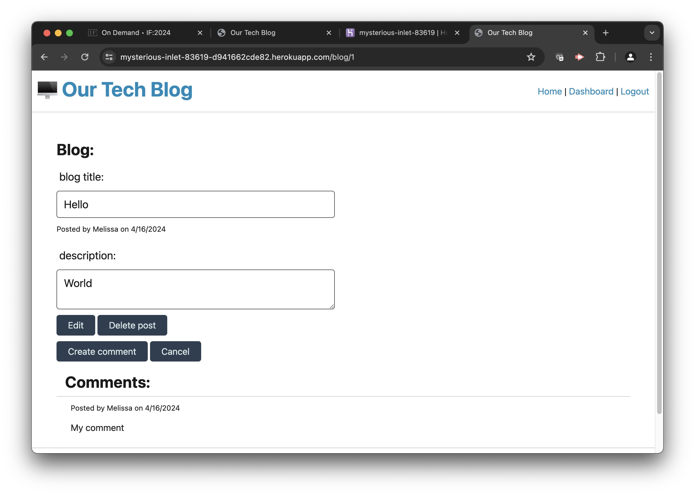

  # my-Tech-Blog
  A CMS-style Tech blog site
  
  # Description
  AS A developer who writes about tech
  I WANT a CMS-style blog site
  SO THAT I can publish articles, blog posts, and my thoughts and opinions

  ## Table of Contents

  [Description](#description) | [License](#license) | [Questions](#questions)

  Deployed techblog showing user creaet, blog create, comment create.
  Shows buttons and functionality. Has blog edit, delete, and login.

  

  

  

  

  

  

  ## License
  
  License: MIT
  
  Badge: https://img.shields.io/badge/License-MIT-yellow.svg
  
  Link: https://opensource.org/licenses/MIT
  
  ## Questions

  Site Heroku: https://mysterious-inlet-83619-d941662cde82.herokuapp.com/

  GitHub username: mbrown50

  GitHub Repo: https://github.com/mbrown50/my-Tech-Blog
 
